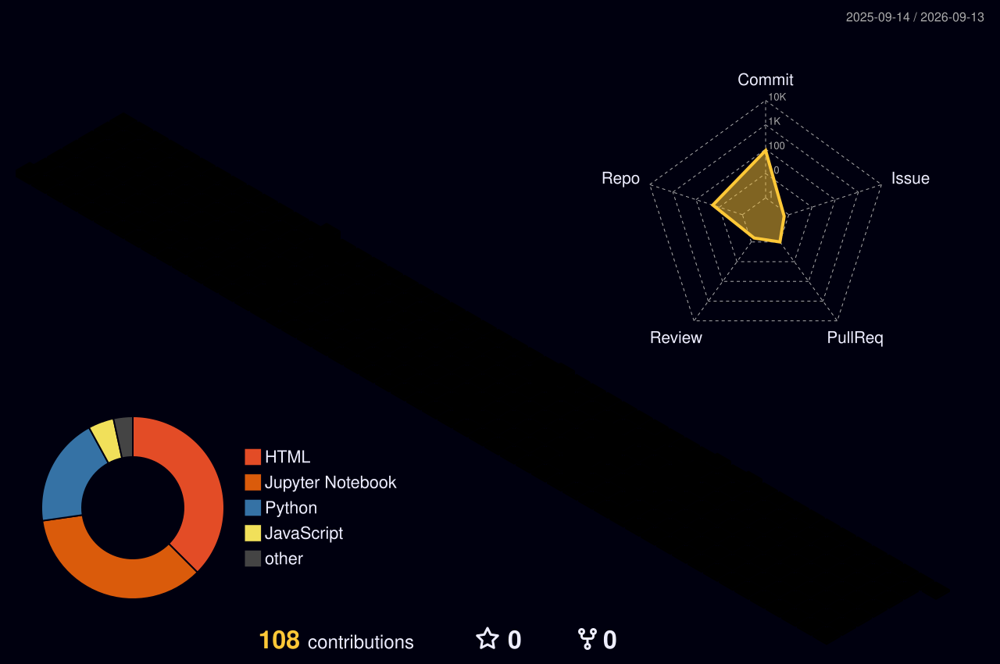

<!-- ================================================================ -->
<!--  JAYA SANDEEP — AI & ML ENGINEER  ·  SandeepOS v4 ULTRA       -->
<!-- ================================================================ -->

<div align="center">

# 🌍 [► LAUNCH INTERACTIVE EXPERIENCE ◄](https://nadipalli-sandeep.github.io/index.html)

> **Click the link above** for the full Hollywood-grade interactive experience —  
> rotating 3D Earth · glowing skill pins · click any pin to open the skill website · warp particles · cinematic intro

<br/>


[](https://linkedin.com/in/jayasandeep)
[](https://kaggle.com/sandeepnadipalli)
[](https://medium.com/@nadipalli.sandeep8)
[](https://www.leetcode.com/jayasandeepncn)
[](https://www.hackerrank.com/jnadipalli_sande1)
[](https://dev.to/jaya-sandeep)
[](https://drive.google.com/file/d/1ScZTwylP8B_CdxAZ0AwO044-Q0hbncfz/view?usp=sharing)

</div>

---

```python
class JayaSandeep:
    name     = "Jaya Sandeep Nadipalli"
    role     = "AI & ML Engineer 🧠"
    location = "India 🇮🇳"
    building = ["LLMs", "Vision Models", "Agentic AI", "RAG Pipelines"]
    learning = ["Multimodal LLMs", "AI Agents", "Fine-Tuning at Scale"]
    stack    = ["Python", "PyTorch", "TensorFlow", "OpenCV", "LangChain"]
    email    = "nadipalli.sandeep8@gmail.com"
    mission  = "Build AI that matters. Ship fast. Break barriers. 🚀"
```

---

## `> git log --3d`

<div align="center">
<a href="https://github.com/nadipalli-sandeep">
  
</a>
</div>

---

## `> git stats --private --all`

<div align="center">

[](https://git.io/streak-stats)

<br/>


<br/>

[](https://github.com/nadipalli-sandeep)

</div>

---

## `> snake --eat-commits`

<div align="center">
<picture>
  <source media="(prefers-color-scheme: dark)"  srcset="https://raw.githubusercontent.com/nadipalli-sandeep/nadipalli-sandeep/output/github-snake-dark.svg"/>
  <source media="(prefers-color-scheme: light)" srcset="https://raw.githubusercontent.com/nadipalli-sandeep/nadipalli-sandeep/output/github-snake.svg"/>
  
</picture>
</div>

---

## `> achievements --unlock-all`

<div align="center">

[](https://github.com/nadipalli-sandeep)

</div>

---

<div align="center">

```
╔══════════════════════════════════════════════════════════╗
║  Always learning. Always building. Always shipping. 🚀  ║
╚══════════════════════════════════════════════════════════╝
```

</div>
