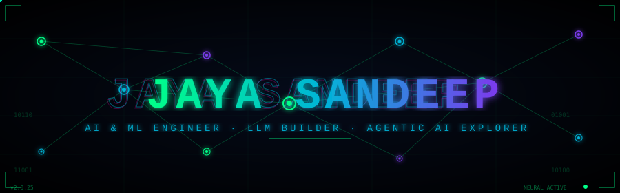
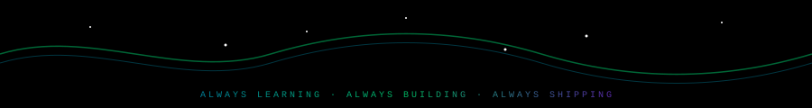

<!-- ================================================================== -->
<!-- STEP 1 of setup: upload header.svg, divider.svg, footer.svg        -->
<!-- to the ROOT of your nadipalli-sandeep/nadipalli-sandeep repo first -->
<!-- ================================================================== -->

<div align="center">

<!-- CUSTOM ANIMATED SVG HEADER (stored in your own repo — never breaks) -->


<br/>

<!-- TYPING ANIMATION -->
[](https://git.io/typing-svg)

<br/>


[](mailto:nadipalli.sandeep8@gmail.com)
[](https://drive.google.com/file/d/1ScZTwylP8B_CdxAZ0AwO044-Q0hbncfz/view?usp=sharing)

</div>



<!-- ================================================================== -->
<!--                         ABOUT ME                                   -->
<!-- ================================================================== -->

## `> whoami`

```python
#!/usr/bin/env python3
# ╔══════════════════════════════════════════════════════════════════╗
# ║              N E U R A L   P R O F I L E   v2.0                ║
# ╚══════════════════════════════════════════════════════════════════╝

class JayaSandeep:
    name       = "Jaya Sandeep Nadipalli"
    title      = "AI & ML Engineer  🧠"
    location   = "India  🇮🇳"
    email      = "nadipalli.sandeep8@gmail.com"

    building   = ["LLMs", "Vision Models", "Agentic AI"]
    learning   = ["RAG Pipelines", "Multimodal LLMs", "AI Agents"]
    collab_on  = ["GenAI Projects", "AI Research", "Open Source ML"]
    ask_me     = ["Python", "ML", "NLP", "C++", "Data Analysis"]

    fun_fact   = "Never been funny… but always funny 😂✨"

    def mission(self):
        return "Build AI that matters. Ship fast. Break barriers. 🚀"

    def stack(self):
        return {
            "🔥 favourite" : "PyTorch + Python",
            "☁️ cloud"     : "AWS  |  Azure",
            "🎯 goal"      : "AGI Researcher someday",
            "☕ fuel"      : "Chai + Code",
        }

print(JayaSandeep().mission())
# ✅  Build AI that matters. Ship fast. Break barriers. 🚀
```


<!-- ================================================================== -->
<!--                       CONNECT                                      -->
<!-- ================================================================== -->

## `> connect --all`

<div align="center">

[](https://linkedin.com/in/jayasandeep)
[](https://dev.to/jaya-sandeep)
[](https://medium.com/@nadipalli.sandeep8)
[](https://kaggle.com/sandeepnadipalli)
[](https://www.leetcode.com/jayasandeepncn)
[](https://www.hackerrank.com/jnadipalli_sande1)
[](https://www.hackerearth.com/@nadipalli.sandeep8)
[](https://www.codechef.com/users/sandeep_nj)

</div>


<!-- ================================================================== -->
<!--                       TECH STACK                                   -->
<!-- ================================================================== -->

## `> ls ./skills`

<div align="center">

**`[ AI · ML · DEEP LEARNING ]`**


**`[ LANGUAGES · BACKEND · DATABASES ]`**


**`[ CLOUD · DEVOPS · TOOLS ]`**


</div>


<!-- ================================================================== -->
<!--                  3D CONTRIBUTION CALENDAR                          -->
<!-- ================================================================== -->

## `> git log --3d`

<div align="center">

<a href="https://github.com/nadipalli-sandeep">
  
</a>

</div>


<!-- ================================================================== -->
<!--                      GITHUB STATS                                  -->
<!-- ================================================================== -->

## `> git stats --all`

<div align="center">

[](https://git.io/streak-stats)

<br/>

[](https://github.com/nadipalli-sandeep)
[](https://github.com/nadipalli-sandeep)

<br/>

[](https://github.com/nadipalli-sandeep)

</div>


<!-- ================================================================== -->
<!--                     SNAKE ANIMATION                                -->
<!-- ================================================================== -->

## `> snake --eat-commits`

<div align="center">
<picture>
  <source media="(prefers-color-scheme: dark)"  srcset="https://raw.githubusercontent.com/nadipalli-sandeep/nadipalli-sandeep/output/github-snake-dark.svg"/>
  <source media="(prefers-color-scheme: light)" srcset="https://raw.githubusercontent.com/nadipalli-sandeep/nadipalli-sandeep/output/github-snake.svg"/>
  
</picture>
</div>


<!-- ================================================================== -->
<!--                        TROPHIES                                    -->
<!-- ================================================================== -->

## `> achievements --list`

<div align="center">

[](https://github.com/nadipalli-sandeep)

</div>


<!-- ================================================================== -->
<!--                      MISSION TABLE                                 -->
<!-- ================================================================== -->

## `> cat mission.json`

<div align="center">

| 🔭 Currently Building | 🌱 Currently Learning | 🤝 Open to Collaborate |
|:---:|:---:|:---:|
| Large Language Models | Agentic AI Frameworks | Generative AI Projects |
| Vision & Multimodal Systems | RAG & Vector Databases | AI Research Papers |
| NLP Pipelines | Fine-Tuning at Scale | Open Source ML Tools |

</div>


<!-- ================================================================== -->
<!--                      BLOG POSTS                                    -->
<!-- ================================================================== -->

## `> rss --fetch medium`

<div align="center">

<!-- BLOG-POST-LIST:START -->
📡 *Auto-syncing soon...*
<!-- BLOG-POST-LIST:END -->

[](https://medium.com/@nadipalli.sandeep8)

</div>

<!-- ================================================================== -->
<!--                        FOOTER                                      -->
<!-- ================================================================== -->


